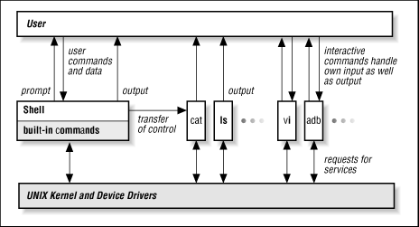

## PySh

> A shell can run on anywhere Python exists.

### Supported shell feature

Common shell features can be found [here](http://www.tldp.org/LDP/intro-linux/html/x12120.html). Pysh already have:

- `|`, Pipe output
- `$var`, Use value for variable
- `" "`, double quote (allows variable and command expansion)

### Usage

```
git clone https://github.com/jiacai2050/pysh.git
cd pysh
python -m pysh.shell

## Demo
> ls
.git
.gitignore
.pre-commit-config.yaml
assets
pysh
README.md

> echo $HOME
/Users/liujiacai

> echo ${JAVA_HOME}
/Library/Java/JavaVirtualMachines/jdk1.8.0_40.jdk/Contents/Home

> pwd
/Users/liujiacai/codes/python/pysh

> cd ..
/Users/liujiacai/codes/python

> pwd
/Users/liujiacai/codes/python

> cat /etc/hosts | grep 127.0.0.1
127.0.0.1       localhost

> grep 127.0.0.1 /etc/hosts
127.0.0.1       localhost
```

Supported commands can be found [here](./pysh/builtins).

More commands are on the way. PR welcomed !

Have fun 😄

### How PySh work

A shell in unix box is a bridge bewteen user and the kernel through [system call](https://en.wikipedia.org/wiki/System_call).



As we can see from above picture, some commands (eg `ls`, `cat`) are passed to other programs, while built-in commands (eg `cd`, `exit`) are executed inside shell. This way can keep shell small in size and strong in function.

In order to let PySh run anywhere (hi, Windows, I mean you), PySh implmented all commands in its core, so there is no [differences](http://unix.stackexchange.com/questions/11454/what-is-the-difference-between-a-builtin-command-and-one-that-is-not) bewteen builtins and one that is not, also you can say all commands are builtins.

One thing I should mention here is:

> Pipelines between different commands are supported by generator in Python.

So, every command should `yield` something, this is like s-expression in Lisp world, where every s-expression should return a value.

### How to contribute

PySh use [pre-commit](http://pre-commit.com/) to keep code quality, so you should install it before contribute.

Fork and PR 🍺

### TODO

- [wildcarding](https://en.wikipedia.org/wiki/Wildcard_character)
- [here documents](https://en.wikipedia.org/wiki/Here_document)
- [command substitution](https://en.wikipedia.org/wiki/Command_substitution)
- [variables](https://en.wikipedia.org/wiki/Variable_%28programming%29)
- [control structures for condition-testing and iteration](https://en.wikipedia.org/wiki/Control_flow)

### License

[MIT License](http://liujiacai.net/license/MIT.html?year=2016) © Jiacai Liu

PySh is inspired from [yosh](https://github.com/supasate/yosh).
